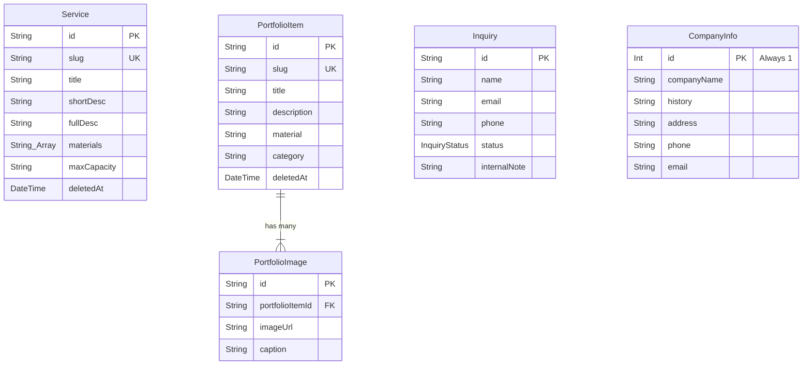

# Dokumentasi Handover Backend & Arsitektur Sistem
**Project**: Company Profile Website — Baruna Jaya Plastik  
**Penyusun**: Lukman (Backend Lead)  
**Terakhir Diperbarui**: 5 September 2026  

---

## 1. Status Penyelesaian Backend (v1 Foundation)

Sisi backend core dan infrastruktur data **sudah 100% selesai untuk tahap pondasi v1**. Kode telah ditest dan lulus pengujian kompilasi produksi Next.js Turbopack (`npm run build` — 0 Error).

### Item yang Sudah Selesai (100% Ready):
* ✅ **Inisialisasi Project**: Framework Next.js App Router + TypeScript + Tailwind CSS.
* ✅ **Database Engine & ORM**: Prisma ORM (v6.19.3) tersambung ke PostgreSQL.
* ✅ **Desain Skema ERD**: 7 Tabel lengkap (`User`, `Service`, `PortfolioItem`, `PortfolioImage`, `Inquiry`, `Testimonial`, `CompanyInfo`).
* ✅ **Fitur Soft-Delete**: Kolom `deletedAt` pada katalog layanan dan portofolio untuk mencegah kehilangan data produksi.
* ✅ **Kontrak Validasi (Zod)**: Schema terpusat di `src/lib/validations/` untuk form publik & admin.
* ✅ **Server Actions (API Engine)**:
  * Form submission `submitInquiryAction` + Notifikasi email instan (Resend API).
  * Pengelolaan status lead `updateInquiryStatusAction` (`NEW`, `CONTACTED`, `CLOSED`).
  * CRUD Katalog Layanan & Soft-delete (`services.ts`).
  * CRUD Portofolio Multi-Foto & Soft-delete (`portfolio.ts`).
  * Pengelolaan Profil Perusahaan Singleton & Testimoni (`company.ts`).
* ✅ **Data Seed Script**: Script pembibitan data domain asli Baruna Jaya Plastik di `prisma/seed.ts` (Alamat Kalideres, material baja 2311/2316/1730, layanan mold injection & blowing, sampel cetakan).

---

## 2. Struktur Folder & Kode Backend

```text
bjp-company-profile/
├── docs/
│   └── BACKEND_HANDOVER.md   <-- Dokumen konteks tim ini
├── prisma/
│   ├── schema.prisma         <-- Schema database utama
│   └── seed.ts               <-- Script seeding data dummy realistis
├── src/
│   ├── actions/              <-- Server Actions (Backend Logic)
│   │   ├── company.ts        <-- Action profil perusahaan & testimoni
│   │   ├── inquiry.ts        <-- Action form kontak & status lead
│   │   ├── portfolio.ts      <-- Action portofolio multi-foto
│   │   └── services.ts       <-- Action layanan molding
│   ├── lib/
│   │   ├── db.ts             <-- Singleton Prisma client
│   │   ├── email.ts          <-- Helper pengiriman email via Resend
│   │   └── validations/      <-- Zod Schemas (Kontrak data Zidan & Lukman)
│   │       ├── inquiry.ts
│   │       ├── portfolio.ts
│   │       └── service.ts
├── .env.example              <-- Template variabel lingkungan
└── package.json              <-- Terkonfigurasi script "npm run db:seed"
```

---

## 3. Ringkasan ERD & Model Data



---

## 4. Panduan Kerja untuk Tiap Anggota Tim

### A. Untuk Zidan (UI / Frontend)
* **Import Data & Actions**: Zidan bisa langsung meng-import tipe TypeScript dari `@prisma/client` atau Server Actions dari `@/actions/*`.
* **Validasi Form Client-Side**: Gunakan Zod schema yang sudah dibuat di `@/lib/validations/*` bersama `react-hook-form` & `@hookform/resolvers/zod`.
* **Dokumentasi Lengkap API**: Rincian contoh *code* fetching dan submit form sudah tersedia di dokumen `api_documentation_for_fe.md`.

### B. Untuk Haikal (Content, SEO & Deployment)
* **Seed Data**: Jika ada perbaikan teks dummy (visi-misi, testimoni, deskripsi baja), Haikal bisa langsung memperbarui file `prisma/seed.ts` atau mengedit via dashboard admin nanti.
* **Environment Variables**: Saat setup Vercel & Neon DB, pastikan meng-copy variabel dari `.env.example`.

---

## 5. Rekomendasi Langkah Selanjutnya (Roadmap Lanjutan)

Berikut adalah urutan kerja yang disarankan untuk melangkah ke tahap berikutnya:

### Prioritas 1: Eksekusi Frontend oleh Zidan (Langsung Jalan)
1. **Design System & Layout**: Setup komponen dasar (Navbar, Footer, Button, Card) berbasis shadcn/ui.
2. **Halaman Publik**: Selesaikan tampilan Halaman Home, About, Services, Portfolio, dan Contact.
3. **Integrasi Form**: Hubungkan form kontak publik dengan `submitInquiryAction`.

### Prioritas 2: Setup Live Database & Auth Admin oleh Lukman
1. **Provisioning DB**: Buat database PostgreSQL di Neon.tech (gratis), lalu masukkan string koneksi ke `.env`.
2. **Migrate & Seed**: Dapatkan database live pertama dengan menjalankan:
   ```bash
   npx prisma migrate dev --name init
   npm run db:seed
   ```
3. **Setup Auth Admin (NextAuth v5 / Database Session)**: Pasang proteksi middleware pada rute `/admin/*` agar hanya admin terautentikasi yang bisa masuk.
4. **Upload Cloudflare R2**: Buat presigned URL generator untuk upload gambar multi-foto langsung dari browser ke R2.

### Prioritas 3: Admin UI & Deployment oleh Haikal & Tim
1. **Admin Dashboard UI**: Buat halaman CRUD Services, Portfolio, Inquiry Status, dan Edit Company Info.
2. **SEO & Deployment**: Pasang schema.org `LocalBusiness`, sitemap.xml, dan hubungkan domain Vercel.
