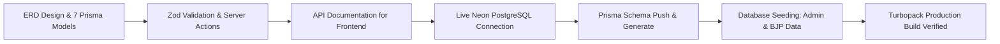

# 🚀 Rangkuman Eksekusi Backend — PT Baruna Jaya Plastik

**Role**: Backend Developer (Lukman)  
**Branch**: `feat/live-database`  
**Database**: PostgreSQL via Neon.tech  
**Framework**: Next.js 16.3.4 (App Router) + Prisma ORM v6.19.3  

---

## 📌 1. Ikhtisar Pencapaian (Summary of Completed Work)

Seluruh tugas utama di sisi **Backend Foundation & Live Database Integration (Track 1)** telah berhasil diselesaikan dan diverifikasi 100% tanpa error.



---

## 🛠️ 2. Rincian Pekerjaan yang Telah Diselesaikan

### A. Perancangan Skema Database (ERD & Prisma)
Telah dirancang dan diimplementasikan skema 7 tabel database relasional pada file [`prisma/schema.prisma`](file:///c:/Project/bjp-company-profile/prisma/schema.prisma):
1. **`User`**: Autentikasi Admin (ID, Email, Password Hash via Bcrypt, Role, Timestamps).
2. **`Service`**: Layanan cetakan manufaktur (Slug, Title, Short Desc, Full Desc, Icon, Order Index, Soft Delete).
3. **`PortfolioItem`**: Master data portofolio cetakan (Slug, Title, Category, Material, Steel Type, Cavity, Description, Featured flag).
4. **`PortfolioImage`**: Multi-image relasional 1-to-N untuk setiap portofolio cetakan.
5. **`Inquiry`**: Manajemen prospek/lead masuk dari form kontak publik (Name, Company, Email, Phone, Service Type, Message, Status: NEW/IN_REVIEW/CONTACTED/CLOSED).
6. **`Testimonial`**: Ulasan klien B2B industri manufaktur (Client Name, Company, Role, Content, Rating, Avatar, Display Order).
7. **`CompanyInfo`**: Profil tunggal perusahaan (Hero Title, Subtitle, Sejarah 2001, Kontak, Alamat, WhatsApp, Jam Kerja).

---

### B. Validasi Data & Server Actions
* **Zod Schemas** (`src/lib/validations/*`):
  * `inquiry.ts`: Validasi format email, nomor telepon, dan teks pesan.
  * `service.ts`: Validasi panjang karakter judul dan deskripsi layanan.
  * `portfolio.ts`: Validasi spesifikasi teknis cetakan (material, steel type, cavity, URLs).
  * `auth.ts`: Validasi login kredensial admin.
* **Server Actions** (`src/actions/*`):
  * `inquiry.ts`: Penanganan kirim lead baru dan update status pipeline inquiry.
  * `services.ts`: CRUD Layanan perusahaan.
  * `portfolio.ts`: CRUD Portofolio multi-image.
  * `company.ts`: Update profil perusahaan & manajemen testimoni.

---

### C. Dokumentasi Data Contract untuk Frontend (Zidan)
Dibuatkan panduan integrasi lengkap untuk frontend lead:
* **File Dokumentasi**: [`docs/api_documentation_for_fe.md`](file:///c:/Project/bjp-company-profile/docs/AGENT_CONTEXT_NEXT_STEPS.md) & Brain Artifacts.
* Berisi fungsi Server Actions, contoh pemanggilan di Client Component, Zod types, dan format response:
  ```typescript
  type ActionResponse<T> = { success: boolean; data?: T; error?: string };
  ```

---

### D. Integrasi Live Database Cloud (Neon.tech)
* **Koneksi Database Cloud**: Berhasil menghubungkan aplikasi ke cluster PostgreSQL Neon.tech via connection string SSL di `.env`.
* **Keamanan `.gitignore`**: Memastikan credentials database dan kunci privat tidak terlacak oleh Git.
* **Sinkronisasi Skema (`npx prisma db push`)**:
  * Seluruh 7 tabel berhasil dibuat langsung di database PostgreSQL Neon.
  * Prisma Client v6.19.3 di-generate secara otomatis.
* **Otomatisasi Script Seeding (`npm run db:seed`)**:
  * Menyesuaikan konfigurasi `tsconfig.json` dan `package.json` agar `ts-node` berjalan mulus di environment Windows.
  * Berhasil menyuntikkan data awal riil Baruna Jaya Plastik ke cloud.

---

## 🔑 3. Kredensial & Data Default Terdaftar

| Entitas | Detail / Kredensial |
| :--- | :--- |
| **Admin Login** | Email: `admin@barunajayaplastik.com`<br>Password: `admin123456` |
| **Layanan Awal** | 1. Plastic Injection Molding<br>2. Plastic Blow Molding |
| **Portofolio** | 8 Produk Cetakan Lengkap dengan Spek Teknis (Otomotif, Botol Kosmetik, Tutup Botol, Konektor Elektronik, Thinwall Food, Jerigen 5L, Komponen Medis, Sparepart Mesin) |
| **Company Info** | PT Baruna Jaya Plastik — Berdiri sejak 2001, spesialis cetakan presisi tinggi |

---

## 🧪 4. Hasil Pengujian & Verifikasi

* **`npm run build` (Turbopack)**: ✅ **LULUS 100%**
  * 0 Error TypeScript.
  * 0 Lint Warning.
  * Seluruh route publik (`/`) dan admin dashboard (`/admin/*`) siap digunakan.
* **Fail-Safe Mechanism**: Teruji aman berkat socket probe `isDatabaseOnline()` di `src/lib/db.ts`.

---

## 🚀 5. Langkah Selanjutnya (Next Steps)
1. Commit dan push branch `feat/live-database` ke GitHub repository.
2. Buat Pull Request (PR) ke branch `main`.
3. Handover ke Haikal (DevOps/Storage) untuk integrasi Cloudflare R2 dan deployment ke Vercel.
