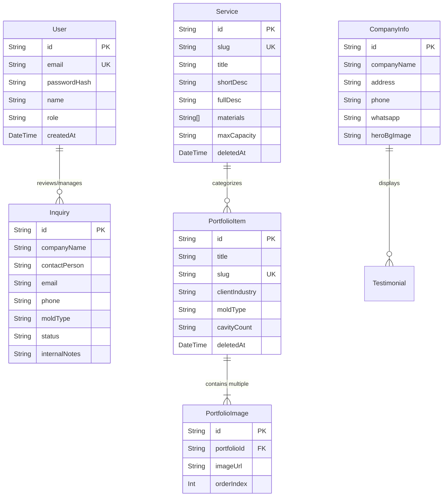

# ⚙️ Detail Teknis Back-End & Database Architecture
**Project**: PT Baruna Jaya Plastik — Company Profile & Admin System  
**Jobdesk / Person in Charge**: **Lukman** (Back-End & Database Lead)  
**Tujuan Dokumen**: Dokumentasi komprehensif mengenai arsitektur logika server, pemodelan database, validasi data, sistem keamanan, dan mekanisme fail-safe anti-freeze.

---

## 1. Ikhtisar Peran & Tanggung Jawab (Scope of Work)
Sisi Back-End bertanggung jawab atas pemrosesan data, integritas basis data, logika bisnis, dan API internal:
* **Server Actions Engine (`src/actions/*`)**: Pemrosesan mutasi data type-safe dari form publik dan dashboard admin.
* **Database & ORM Management**: Skema Prisma, migrasi, indexing relasi, dan integrasi PostgreSQL.
* **Fail-Safe & Resilience Data Layer**: Perlindungan dari *database freeze* atau *cold-start* melalui sistem fallback ganda.
* **Validasi Terpusat (Data Contracts)**: Skema Zod untuk sanitasi input sebelum masuk ke database.
* **Security & Auth**: Proteksi kata sandi admin dengan hashing Bcrypt dan autentikasi sesi.
* **Integrasi Layanan Notifikasi**: Pengiriman otomatis email pemberitahuan leads penawaran via Resend API.

---

## 2. Stack Teknologi & Pustaka Utama

| Teknologi / Library | Versi | Peran & Implementasi |
| :--- | :--- | :--- |
| **Next.js Server Actions** | `16.3.4` | Alternatif modern REST API yang dieksekusi di lingkungan server dengan RPC aman. |
| **Prisma ORM** | `^6.19.3` | Object-Relational Mapping untuk PostgreSQL, generator tipe TypeScript otomatis. |
| **PostgreSQL (Neon.tech)** | `v16` | Database relasional serverless di AWS Asia Pacific (Singapore) dengan koneksi SSL. |
| **Zod** | `^3.24.0` | Skema validasi data deklaratif (run-time validation & static type inference). |
| **Bcryptjs** | `^2.4.3` | Algoritma hashing satu arah untuk proteksi kredensial login admin. |
| **Resend** | `^4.0.0` | API pengiriman email transactional untuk pemberitahuan Request for Quotation (RFQ). |

---

## 3. Arsitektur Mutasi Data: Server Actions (`src/actions/*`)

Seluruh komunikasi mutasi data menggunakan **Next.js Server Actions** (`"use server"`), meniadakan kebutuhan konfigurasi endpoint API manual (`/api/*`).

### A. Kontrak Standarisasi Respons
Setiap action mengembalikan tipe data yang seragam untuk mempermudah penanganan status di UI:
```typescript
export type ActionResponse<T = any> = {
  success: boolean;
  data?: T;
  error?: string;
};
```

### B. Modul Server Actions
1. **`src/actions/services.ts`**:
   - `createServiceAction`: Menambahkan layanan baru dengan slug otomatis dan order index.
   - `updateServiceAction`: Memperbarui data judul, deskripsi, material, kapabilitas, dan kapasitas maksimal.
   - `deleteServiceAction`: Menerapkan *soft-delete* (menyetel kolom `deletedAt = new Date()`).
2. **`src/actions/portfolio.ts`**:
   - `createPortfolioAction`: Menyimpan proyek cetakan baru dengan dukungan multi-gambar (`PortfolioImage`).
   - `updatePortfolioAction` & `deletePortfolioAction`: Modifikasi dan soft-delete data proyek.
3. **`src/actions/inquiry.ts`**:
   - `submitInquiryAction`: Menampung formulir prospek dari calon pembeli publik, memicu email notifikasi ke tim marketing via Resend.
   - `updateInquiryStatusAction`: Mengubah status prospek (`NEW`, `CONTACTED`, `CLOSED`) dan menyimpan catatan internal sales.
4. **`src/actions/company.ts`**:
   - `updateCompanyInfoAction`: Pembaruan nomor telepon, WhatsApp, email, dan alamat pabrik.
   - `updateCompanyHeroAction`: Pengaturan tagline dan gambar latar hero.
5. **`src/actions/auth.ts`**:
   - `loginAction`: Verifikasi kredensial admin terhadap hash Bcrypt dan inisialisasi cookie sesi.

### C. Cache Revalidation
Setiap kali mutasi data berhasil, action memanggil `revalidatePath`:
```typescript
revalidatePath("/", "page");
revalidatePath("/admin/services", "page");
```
Hal ini memastikan pengunjung dan admin langsung melihat data terbaru secara instan tanpa reload browser.

---

## 4. Desain Database & Skema Prisma (`prisma/schema.prisma`)

Database menggunakan PostgreSQL dengan 7 tabel utama yang didesain secara modular dan mendukung *soft delete*:



### Karakteristik Desain Basis Data:
* **Soft Delete Pattern**: Tabel `Service` dan `PortfolioItem` memiliki kolom `deletedAt DateTime?`. Data tidak pernah dihapus permanen (`DROP/DELETE`), melainkan hanya difilter `where: { deletedAt: null }` untuk menjaga riwayat proyek.
* **Array Types**: Kolom `materials` pada PostgreSQL disimpan sebagai `String[]` native untuk efisiensi penyimpanan tag kapabilitas dan material baja cetakan (Stavax, DIN 1.2316, dll).

---

## 5. Mekanisme Fail-Safe & Anti-Freeze (`src/lib/db.ts` & `src/lib/data/*`)

### A. Masalah Cold-Start Database Serverless
Database serverless Neon PostgreSQL secara otomatis masuk ke kondisi *idle/sleep* jika tidak diakses selama 5 menit. Saat request pertama masuk, proses *wake-up* membutuhkan waktu ~3–4 detik. Jika aplikasi menunggu tanpa batas waktu atau timeout terlalu singkat, aplikasi bisa mengalami *TCP timeout freeze* atau salah menganggap database mati.

### B. Solusi: Arsitektur Data Ganda (Dual-Layer Resilience)
1. **Probe Koneksi Optimal ([`src/lib/db.ts`](file:///c:/Documents/Projects/bjp-company-profile/src/lib/db.ts))**:
   - Fungsi `isDatabaseOnline()` mengeksekusi `SELECT 1` dengan toleransi timeout **6.000 ms**.
   - Dilengkapi cache status di memori selama **10 detik** untuk mencegah spam query probe saat navigasi intensif di dashboard admin.
2. **Data Fallback & Local Snapshot ([`src/lib/data/*`](file:///c:/Documents/Projects/bjp-company-profile/src/lib/data/)):**
   - Saat database online: Data dibaca dan ditulis langsung ke database Neon via Prisma.
   - Saat database mengalami gangguan jaringan: Modul `getActiveServices()` atau `getPortfolioItems()` otomatis membaca data snapshot lokal (`data/services.json` atau `DEFAULT_SERVICES`).
   - Hasil: Halaman publik **dijamin 100% selalu terbuka dengan cepat** dan tidak pernah menghasilkan halaman error 500.

---

## 6. Validasi Input & Keamanan (Zod & Bcrypt)

* **Skema Validasi ([`src/lib/validations/*`](file:///c:/Documents/Projects/bjp-company-profile/src/lib/validations/))**:
  - `inquirySchema`: Memeriksa panjang nama, validitas email, nomor telepon, dan sanitasi teks pesan untuk menangkal serangan injection.
  - `serviceSchema` & `portfolioSchema`: Memeriksa kelengkapan judul, spesifikasi teknis, dan rentang tonase.
* **Proteksi Kata Sandi**:
  - Password admin disimpan menggunakan `bcryptjs.hash(password, 10)`.
  - Pengecekan dilakukan dengan perbandingan aman waktu konstan `bcryptjs.compare()` untuk mencegah serangan *timing attack*.

---

## 7. Layanan Email Transaksional (Resend API)

* Terletak di [`src/lib/email.ts`](file:///c:/Documents/Projects/bjp-company-profile/src/lib/email.ts).
* Memformat email berstandar HTML formal berlogo PT Baruna Jaya Plastik yang berisi rincian penawaran (Nama Pengirim, Perusahaan, Telepon, Jenis Cetakan, Estimasi Tonase, Pesan).
* Mengirimkan tembusan langsung ke email manajemen/sales segera setelah form kontak disubmit.

---

## 8. Script Pembibitan Data (Seed Script)
* File: `prisma/seed.ts` (Dijalankan dengan perintah `npm run db:seed`).
* Mengisi database baru secara otomatis dengan:
  - 1 Akun Administrator default (`admin@barunajayaplastik.com`).
  - 4 Layanan cetakan presisi lengkap dengan kapasitas maksimal standar.
  - Portofolio awal industri otomotif, kemasan medis, dan elektronik.
  - Informasi kontak resmi PT Baruna Jaya Plastik (Kalideres, Jakarta Barat).
