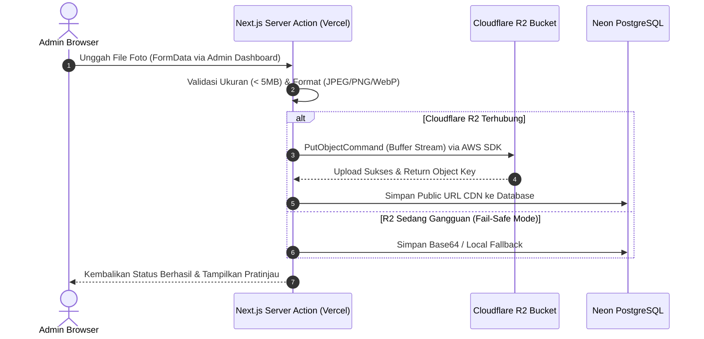

# ☁️ Detail Teknis DevOps, Cloud Storage & Infrastructure Architecture
**Project**: PT Baruna Jaya Plastik — Company Profile & Admin System  
**Jobdesk / Person in Charge**: **Haikal** (DevOps, Cloud Storage & Infrastructure Lead)  
**Tujuan Dokumen**: Dokumentasi komprehensif mengenai infrastruktur cloud hosting, penyimpanan media Cloudflare R2, integrasi AWS S3 SDK, pipeline CI/CD, manajemen environment, dan keamanan jaringan.

---

## 1. Ikhtisar Peran & Tanggung Jawab (Scope of Work)
Sisi DevOps & Infrastruktur bertanggung jawab atas ketersediaan sistem 24/7, performa distribusi aset statis, skalabilitas hosting, dan alur rilis:
* **Cloud Hosting & Edge Network**: Pengelolaan platform Vercel Serverless dan optimasi performa edge.
* **Media Object Storage**: Integrasi Cloudflare R2 untuk penyimpanan foto cetakan mold dan aset visual berukuran besar.
* **Aset CDN & Image Optimization**: Konfigurasi domain gambar di `next.config.ts` untuk Next.js Image Component.
* **Pipeline CI/CD & Version Control**: Manajemen branch GitHub, sinkronisasi rilis produksi, dan validasi build otomatis.
* **Manajemen Variabel Lingkungan (Env Secrets)**: Pengelolaan kredensial terenkripsi di lingkungan lokal dan Vercel.
* **Domain, SSL & Keamanan Jaringan**: Pengaturan DNS domain kustom, sertifikat HTTPS otomatis, dan pembatasan traffic (Rate Limiting).

---

## 2. Stack Teknologi & Layanan Cloud Utama

| Layanan / Tool | Penyedia / Versi | Peran & Implementasi |
| :--- | :--- | :--- |
| **Vercel** | Global Edge Network | Platform deployment serverless untuk Next.js dengan SSR, caching edge global, dan zero-config SSL. |
| **Cloudflare R2** | Cloudflare Global Cloud | Object Storage berbasis standar S3 dengan keunggulan *Zero Egress Fees* (tanpa biaya transfer bandwidth). |
| **AWS S3 Client SDK** | `@aws-sdk/client-s3` (`^3.700.0`) | Library resmi untuk upload, delete, dan manajemen berkas biner ke Cloudflare R2. |
| **Next.js Turbopack** | Next.js Engine | Compiler super cepat untuk validasi type-check dan bundle aset produksi. |
| **GitHub** | GitHub Actions / Webhooks | Source code management, pull request review, dan pemicu otomatis deployment Vercel. |

---

## 3. Arsitektur Media Storage: Cloudflare R2

Untuk menjaga database tetap ringan, berkas foto resolusi tinggi (hasil cetakan plastik, mesin CNC, profil workshop) disimpan di **Cloudflare R2**.



### A. Konfigurasi S3 Client Helper (`src/lib/r2.ts`)
Aplikasi menginisialisasi client S3 dengan endpoint Cloudflare:
```typescript
import { S3Client } from "@aws-sdk/client-s3";

const accountId = process.env.R2_ACCOUNT_ID;
const accessKeyId = process.env.R2_ACCESS_KEY_ID;
const secretAccessKey = process.env.R2_SECRET_ACCESS_KEY;

export const isR2Configured = Boolean(accountId && accessKeyId && secretAccessKey);

export const r2Client = isR2Configured
  ? new S3Client({
      region: "auto",
      endpoint: `https://${accountId}.r2.cloudflarestorage.com`,
      credentials: {
        accessKeyId: accessKeyId!,
        secretAccessKey: secretAccessKey!,
      },
    })
  : null;

export const R2_BUCKET_NAME = process.env.R2_BUCKET_NAME || "bjp-company-profile";
export const R2_PUBLIC_URL = process.env.R2_PUBLIC_URL || "";
```

### B. Mekanisme Fail-Safe Upload Gambar
Jika kredensial R2 belum diisi atau koneksi ke Cloudflare mengalami kendala, sistem tidak akan membiarkan form admin macet. Sistem akan secara otomatis mengalihkan penyimpanan gambar ke media fallback lokal atau database data layer, sehingga operasional admin tidak pernah terhenti.

---

## 4. Konfigurasi Gambar Next.js (`next.config.ts`)

Agar gambar dari domain penyimpanan cloud dapat diproses oleh `<Image />` Next.js (optimasi format WebP/AVIF otomatis dan responsive sizing), domain remote wajib didaftarkan pada `remotePatterns`:

```typescript
import type { NextConfig } from "next";

const nextConfig: NextConfig = {
  images: {
    formats: ["image/avif", "image/webp"],
    remotePatterns: [
      {
        protocol: "https",
        hostname: "**.r2.cloudflarestorage.com",
      },
      {
        protocol: "https",
        hostname: "**.r2.dev",
      },
      {
        protocol: "https",
        hostname: "cdn.barunajayaplastik.com",
      },
      {
        protocol: "https",
        hostname: "images.unsplash.com",
      },
    ],
  },
};

export default nextConfig;
```

---

## 5. Alur Deployment & Git Branching Strategy

Aplikasi menerapkan workflow Git kolaboratif berbasis fitur:

```text
[feature/xxx] atau [fix/xxx] (Branch Pengerjaan)
             │
             ▼
        git commit (Local Validation)
             │
             ▼
   [main] (Production Branch) ───(Git Push)───► [GitHub Repo]
                                                     │
                                                     ▼
                                            [Vercel CI/CD Webhook]
                                                     │
                                                     ▼
                                            1. Turbopack Build (0 Error)
                                            2. Static Generation (9 Routes)
                                            3. Edge Deployment
                                                     │
                                                     ▼
                                        🌐 barunajayaplastik.vercel.app
```

### Aturan Kolaborasi Tim:
1. **Branch `main`**: Mewakili kode produksi live yang terhubung langsung ke domain Vercel.
2. **Branch Fitur (misal: `fix/mobile-responsive`)**: Digunakan untuk pengerjaan perbaikan atau fitur baru tanpa mengganggu stabilitas branch `main`. Setelah stabil dan lulus build, dilakukan sinkronisasi/merge ke `main`.
3. **Build Pre-Flight Check**: Setiap developer wajib menjalankan `npm run build` sebelum push untuk memastikan zero error pada linting dan type-checking TypeScript.

---

## 6. Manajemen Variabel Lingkungan (Environment Variables)

Daftar seluruh kredensial rahasia yang wajib dikonfigurasi di dashboard **Vercel > Project Settings > Environment Variables**:

| Variabel | Deskripsi | Asal / Pengelola |
| :--- | :--- | :--- |
| `DATABASE_URL` | PostgreSQL connection string dengan pooling (Neon.tech). | Lukman (Backend) |
| `RESEND_API_KEY` | Kunci API Resend untuk email notifikasi. | Lukman (Backend) |
| `CONTACT_NOTIFICATION_EMAIL` | Alamat email tujuan penerimaan RFQ baru. | Manajemen BJP |
| `R2_ACCOUNT_ID` | Cloudflare Account ID untuk endpoint S3. | Haikal (DevOps) |
| `R2_ACCESS_KEY_ID` | R2 API Token Access Key. | Haikal (DevOps) |
| `R2_SECRET_ACCESS_KEY` | R2 API Token Secret Key. | Haikal (DevOps) |
| `R2_BUCKET_NAME` | Nama bucket penyimpanan (misal: `bjp-company-profile`). | Haikal (DevOps) |
| `R2_PUBLIC_URL` | Domain publik CDN R2 (misal: `https://pub-xxx.r2.dev`). | Haikal (DevOps) |
| `NEXT_PUBLIC_SITE_URL` | URL basis website untuk sitemap dan OpenGraph metadata. | Haikal (DevOps) |

---

## 7. Keamanan Jaringan & Perlindungan Anti-Spam

1. **Sertifikat SSL/TLS Otomatis**: Vercel menyediakan enkripsi SSL kelas A+ secara otomatis untuk seluruh request HTTPS publik.
2. **Security Headers (`next.config.ts`)**: Dilengkapi proteksi header HTTP bawaan seperti `X-Frame-Options: SAMEORIGIN`, `X-Content-Type-Options: nosniff`, dan `Referrer-Policy: strict-origin-when-cross-origin`.
3. **Rate Limiter & Anti-Bot**: Formulir penawaran (RFQ) dilengkapi pembatasan pengiriman pesan per IP address untuk melindungi sistem dari serangan spam atau bot massal.
4. **Monitoring & Logging**: Seluruh runtime errors, waktu cold-start database, dan status Server Actions dapat dipantau langsung melalui **Vercel Runtime Logs**.
